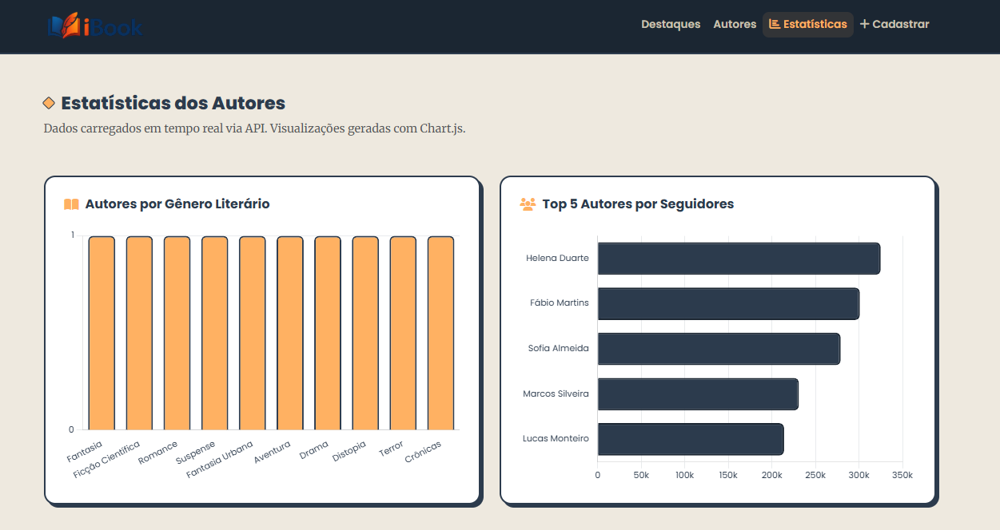
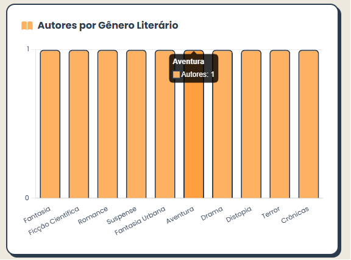
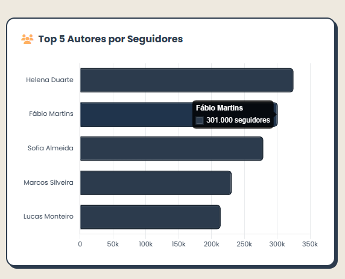

# Trabalho Prático - Semana 14

A partir dos dados que você tem no seu projeto, vamos trabalhar formas de apresentação que representem de forma clara e interativa essas informações. Você poderá usar gráficos (barra, linha, pizza), mapas, calendários ou outras formas de visualização. Seu desafio é entregar uma página Web que organize, processe e exiba os dados de forma compreensível e esteticamente agradável.

Com base nos tipos de projetos escohidos, você deve propor **visualizações que estimulem a interpretação, agrupamento e exibição criativa dos dados**, trabalhando tanto a lógica quanto o design da aplicação.

Sugerimos o uso das seguintes ferramentas acessíveis: [FullCalendar](https://fullcalendar.io/), [Chart.js](https://www.chartjs.org/), [Mapbox](https://docs.mapbox.com/api/), para citar algumas.

A partir dos dados do projeto iBook, foram implementadas visualizações dinâmicas com **Chart.js** para apresentar as informações dos autores cadastrados de forma clara e interativa.

## Informações do trabalho

- **Nome:** Bernardo Diniz
- **Matrícula:** 908681
- **Projeto:** iBook — Plataforma de Descoberta de Autores e Obras Literárias
- **Descrição:** Plataforma web para explorar autores de literatura e suas obras. Esta etapa adiciona uma página de estatísticas com gráficos interativos gerados a partir dos dados da API.

---

## Visualização implementada: Gráficos com Chart.js

A página `visualizacao.html` exibe dois gráficos carregados em tempo real via Fetch API:

### Gráfico 1 — Autores por Gênero Literário

Gráfico de barras verticais que agrupa os autores cadastrados por gênero literário. Os dados são buscados via `GET /autores` e processados em JavaScript para contagem por gênero.

### Gráfico 2 — Top 5 Autores por Seguidores

Gráfico de barras horizontais que exibe os 5 autores com maior número de seguidores. Os dados são ordenados e fatiados antes de renderizar no Chart.js.

---

## Estrutura do db.json

O arquivo `db/db.json` contém três coleções:

- **`autores`** — 10 autores com nome, gênero, biografia, seguidores, obras e destaque
- **`categorias`** — 10 gêneros literários
- **`usuarios`** — usuários do sistema (reservado para autenticação futura)

---

## Rotas da API utilizadas

| Método | Endpoint | Função |
|--------|----------|--------|
| GET | `/autores` | Lista todos os autores (Home + Gráficos) |
| GET | `/autores?destaque=true` | Lista autores em destaque (Carrossel) |
| GET | `/autores/:id` | Busca autor por ID (Detalhe) |
| POST | `/autores` | Cadastra novo autor (Formulário) |

---

## Prints do trabalho

### Gráfico — Autores por Gênero Literário

### Gráfico — Top 5 Autores por Seguidores

